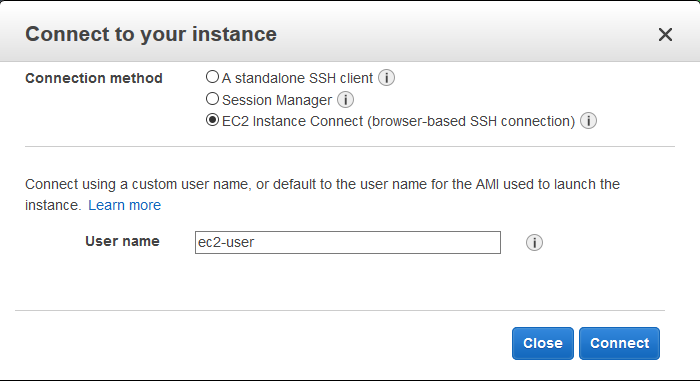

EC2 Instance Connect is somewhat overlooked functionality improving security of EC2 logins. During configuration, the **default** instance user is assigned a public key so it's private pair can be used to connect to the instance. The private key tends to be shared within support teams and logins can no longer be attributed to an individual. EC2 instance Connect runs and logs connect commands as the individual user and obeys user's permission.

Onto the steps. Run:

```
 aws ec2-instance-connect send-ssh-public-key --instance-id i-0123abc --instance-os-user ec2-user --availability-zone us-east-1b --ssh-public-key file://id_rsa.pub
```

Substitute the right values for your instance, they can be found on the **AWS Console** or queried running ```aws ec2 describe-instances```.

After above command successful, use (routable) FQDN/IP to connect to your instance (some operating systems use a different **default** user):

```
ssh ec2-user@1.2.3.4
```
The functionality also available from the **AWS Console**:



This activity is logged by [CloudTrail](https://aws.amazon.com/cloudtrail/) although the shell commands still being run as the **default** instance user.

While EC2 Instance Connect offers less functionality as compared to other tooling like [AWS Systems Manager SSM](https://docs.aws.amazon.com/systems-manager/) or a **proper** Privileged Access Management (PAM) tool, it requires no additional configuration on the instance.